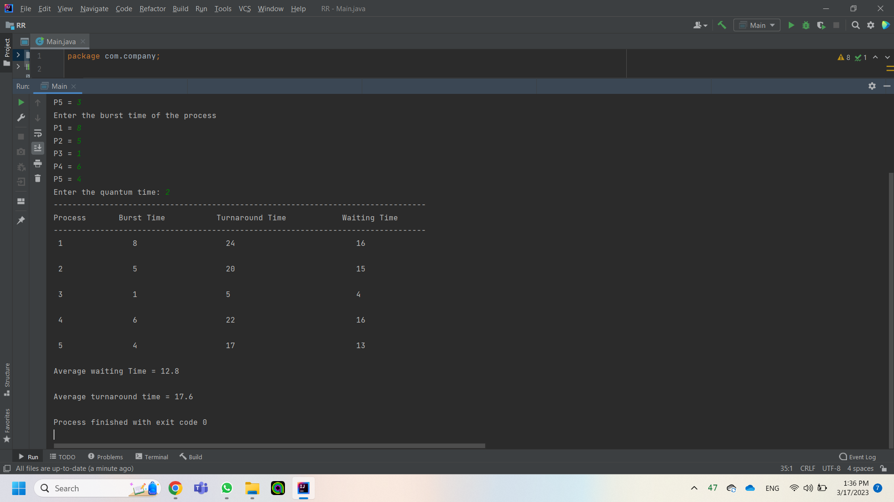
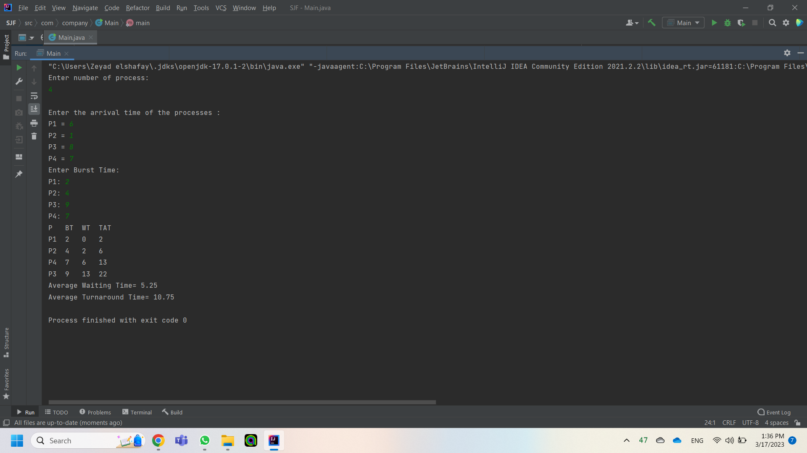

# assignment
this is an implementation of RR @ SJF 

## RR

first of all we declare the variables that we will use later on as n which is no of processes and bt which is burst time & wt which is waiting time all as int arrays 

then we let the user inputs the no of processes &after that the user inputs the arrival time of each process and the burst time then the program asks for the quantum time 

then a while loop begins as that the process that finishes its quantum time is put at the back of the array and so on so that RR is implemented and also we increase the count at the end of each quantum time when all processes have been finished we display them as shown

## SJF

first of all we declare the variables that we will use later on as n which is no of processes and
bt which is burst time & wt which is waiting time all as int arrays and an 2d array for turnaround 
time 

then we let the user inputs the no of processes &after that the user inputs the arrival time of 
each process and the burst time in an for loop

then a for loop which begin to check every process's burst time and see the shortest using data 
structure linked list then the smallest go and process and so on till all processes have been processed then the program calculate waiting time and turnaround time and their average 

then we display them in a nice table as shown

